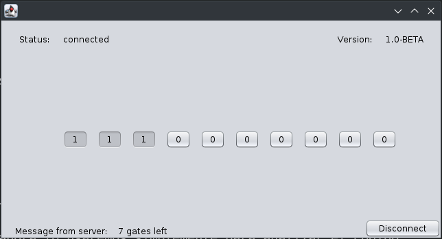
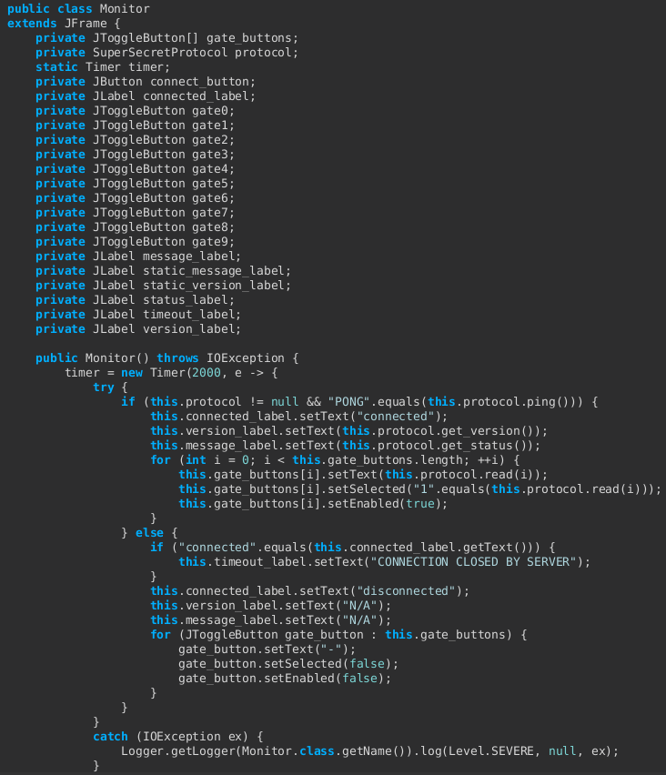

# writeup

## Descripción
El reto consiste en una aplicación desarrollada en Java. Para ejecutarla, podemos ejecutar el siguiente comando:
```bash
java -jar ./clientside.jar
```

Tras lanazar la aplicación, nos encontramos con la siguiente interfaz gráfica:


De primeras no sale nada, pero si el das a conectar, empieza a traerse información del servidor:


Si vamos haciendo click en los botones, empezamos a ver como el mensaje del servidor va cambiando. El objetivo es claro: conseguir cerrar todas las puertas.



Al cabo de un rato, vemos que el servidor cierra la conexión.


Aunque intentemos cerrar todas las puertas rápidamente, existe un timeout que no permite pulsar los botones lo suficientemente rápido.

Podemos abrir el jar con un programa como Recaf. Recaf permite decompilar archivos jar y class, además de modificarlos. Por ahora lo usaremos simplemente para analizar el código.

Se ve rápidamente que las clases más interesantes se encuentran en com.hackiit.adhoc.client.


Si analizamos la clase Monitor, podemos ver que:
 - Existe un timer el cual no permite pulsar dos botones seguidos en una ventana de 2 segundos.
 - Existe un objeto SuperSecretProtocol el cual gestiona las comunicaciones con el servidor.



Analizando la clase SuperSecretProtocol, podemos ver que:
 - El servidor al que se conecta es *retos.hackiit.org:31423*
 - Se define un protocolo custom con el que el cliente habla y se trae información del servidor.


Este protocolo también podríamos haberlo visto abriendo Wireshark y analizando las comunicaciones:


Viendo esto, podemos solucionar el reto de 2 formas diferentes:

## Solución 1: Parchear la aplicación Java
Con el mismo programa con el que hemos hecho el análisis, podríamos parchear la aplicación para quitarle el timer y poder cerrar todas las puertas sin ningúna limitación por parte del cliente.


Una vez hecho este cambio, podemos volver a exportar el jar y ejecutarlo. Comprobaremos que ya no tenemos la restricción de 2 segundos entre cada click y obtenemos la flag:


## Solución 2: Cliente custom
Como sabemos cómo funciona el protocolo custom al haber hecho analisis de la aplicación (o habiendo visto la comunicación en Wireshark), podemos hacer un cliente que hable directamente con el servidor.

La idea sería enviar al servidor los comandos necesarios para cerrar todas las puertas. Puede verse un ejemplo en [solve.py](./solve.py)

Al ejecutarlo, también obtenemos la flag:
 


## Solución 3: Parchear la aplicación en ejecución
Existen herramientas como Arthas que permiten modificar el comportamiento de la aplicación en ejecución. Se deja como ejercicio :)
