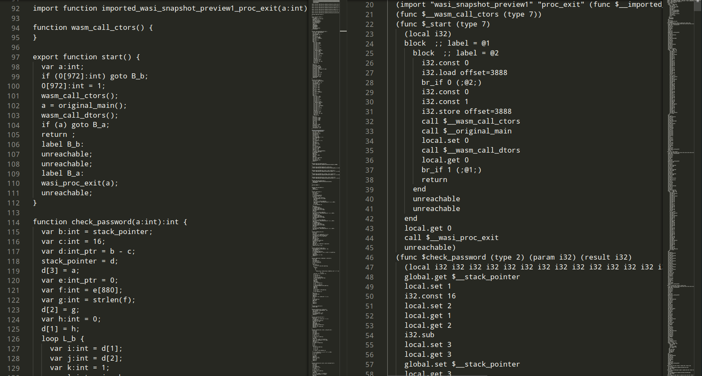

# Reversing de WASM

WebAssembly es un formato de código binario portátil diseñado para su ejecución en navegadores web y otros entornos. Su capacidad para ejecutar código de manera eficiente y segura ha llevado a su creciente popularidad en el desarrollo de aplicaciones web. En este desafío consiste en realizar ingeniería inversa sobre un archivo WASM que utiliza el formato WASI (WebAssembly System Interface). El formato WASI proporciona una interfaz estandarizada entre el código WebAssembly y el sistema operativo subyacente. Permite a los programas WASM interactuar con el entorno de ejecución, incluyendo el acceso al sistema de archivos, la comunicación de red y otras operaciones de bajo nivel. 

Para ejecutar un archivo WASM que utilice la interfaz WASI hace falta un programa como Wasmtime:

```
$ wasmtime reto.wasi.wasm
Introduce la contraseña:
123245
Contraseña incorrecta
```


A la hora de investigar un archivo binario, no es mala idea comprobar los strings que contiene, además, como el archivo no es demasiado grande, podemos entretenernos en ver todos los strings:

```
$ strings reto.wasi.wasm
.
.
.
wjqA
-+   0X0x
-0X+0X 0X-0x+0x 0x
wasi
Contrase
a incorrecta
DSRHHS^BSE
Introduce la contrase
(null)
%s{%s_%s_%s}
SuperSecurePassword
Support for formatting long double values is currently disabled.
.
.
.
```

En parte podemos ver algunos strings de interés, como `"%s{%s_%s_%s}"`, un format string de C que podría darnos una pista sobre la flag, o `"SuperSecurePassword"`, un string bastante sospechoso...

```
$ wasmtime reto.wasi.wasm
Introduce la contraseña:
SuperSecurePassword
Contraseña incorrecta
```

No iba a ser tan facíl, así que toca encontrar otra forma de atacar este reto. Si buscamos en google alguna forma de descompilar un archivo WASM, uno de los primeros resultados es la utilidad [wasm-decompile](https://github.com/WebAssembly/wabt/blob/main/docs/decompiler.md). Esta herramienta pertenece al proyecto [wabt (WebAssembly Binary Toolkit)](https://github.com/WebAssembly/wabt), un conjunto de herramientas para tratar archivos wasm. La herramienta wasm-decompile permite convertir un archivo webassembly a un lenguaje propio similar a Javascript. Este lenguaje solo está pensado para facilitar la lectura de los archivos wasm, no para ser ejecutado.

Podemos descompilar el archivo del reto de la siguient forma:

```
$ wasm-decompile reto.wasi.wasm -o reto_descompilado
```

 

El resultado es un archivo con gran cantidad de funciones, por suerte algunos nombres funcione nos indican que deberiamos echarles un vistazo:

* `function check_password(a:int):int`
* `function print_flag()`
* `function original_main():int`


El código descompilado con wasm-decompile tiene bastante ruido debido a como funciona el propio formato wasm, no obstante en la función `original_main` podemos ver que se hace una llamada a la función `print_flag()`, pero justo antes hay otra llamada a la funcion `check_password()` y un if que utiliza la salida de la llamada a `check_password()`. Si nos fijamos podemos ver que este if se salta la llamada a `print_flag()` dependiendo del resultado de la funcion `check_password()` 

```typescript
function original_main():int {
  var a:int = stack_pointer;
  var b:int = 48;
  var c:int = a - b;
  stack_pointer = c;
  var d:int = 0;
  c[11]:int = d;
  var e:int = 22;
  var f:long_ptr@2 = c + e;
  var g:long = 0L;
  f[0] = g;
  var h:int = 16;
  var i:long_ptr = c + h;
  i[0] = g;
  c[1]:long = g;
  c[0]:long = g;
  var j:int = 1115;
  puts(j);
  var k:int = c;
  var l:int_ptr = 0;
  var m:int = l[329];
  var n:int = 30;
  fgets(k, n, m);
  var o:int = c;
  var p:int = check_password(o);
  if (eqz(p)) goto B_b;
  print_flag();
  goto B_a;
  label B_b:
  var q:int = 1073;
  puts(q);
  label B_a:
  var r:int = c[11]:int;
  var s:int = 48;
  var t:int = c + s;
  stack_pointer = t;
  return r;
}
```


Si pudiéramos encontrar una forma de evitar ese if, la función print_flag se ejecutaría sin importar la contraseña, no obstante como se ha dicho antes, el lenguaje de salida de wasm-decompile no está pensado para ser ejecutado, por lo que necesitamos otro formato que podamos editar y ejecutar.

Webassembly tiene dos formatos, wasm, el formato binario y wat, el formato texto. A continuación se muestra una tabla en la que se comparan ambos formatos con su correspondiente código fuente en C:

| Codigo fuente en C                                           | WebAssembly .wat                                             | WebAssembly .wasm                                            |
| ------------------------------------------------------------ | ------------------------------------------------------------ | ------------------------------------------------------------ |
| int factorial(int n) {<br>  if (n == 0)<br>    return 1;<br>  else<br>    return n * factorial(n-1);<br>} | (func (param i64) (result i64)<br>  local.get 0<br>  i64.eqz<br>  if (result i64)<br>      i64.const 1<br>  else<br>      local.get 0<br>      local.get 0<br>      i64.const 1<br>      i64.sub<br>      call 0<br>      i64.mul<br>  end) | 00 61 73 6D 01 00 00 00<br>01 06 01 60 01 7E 01 7E<br>03 02 01 00<br>0A 17 01<br>15 00<br>20 00<br>50<br>04 7E<br>42 01<br>05<br>20 00<br>20 00<br>42 01<br>7D<br>10 00<br>7E<br>0B<br>0B |

Usando una de las herramientas de wabt, podemos convertir entre ambos formatos sin problemas:

```
$ wasm2wat reto.wasi.wasm -o reto.wat
```

El archivo reto.wat generado tiene mas de 8000 lineas y utiliza una sintaxis poco común si no se está familiarizado con el formato. No obstante, si nos fijamos, podemos ver que afortunadamente sigue una estructura similar a el archivo generado mediante wasm-decompile, por lo que si los ponemos en paralelo podemos entender con mas facilidad el formato wat.




Sabiendo esto ahora es mas fácil comprender el código y buscar la función `original_main`, que recordemos es la función que originalmente queríamos modificar:

```lisp
  (func $__original_main (type 8) (result i32)
    (local i32 i32 i32 i32 i32 i32 i64 i32 i32 i32 i32 i32 i32 i32 i32 i32 i32 i32 i32 i32)
    global.get $__stack_pointer
    local.set 0
    i32.const 48
    local.set 1
    local.get 0
    local.get 1
    i32.sub
    local.set 2
    local.get 2
    global.set $__stack_pointer
    i32.const 0
    local.set 3
    local.get 2
    local.get 3
    i32.store offset=44
    i32.const 22
    local.set 4
    local.get 2
    local.get 4
    i32.add
    local.set 5
    i64.const 0
    local.set 6
    local.get 5
    local.get 6
    i64.store align=2
    i32.const 16
    local.set 7
    local.get 2
    local.get 7
    i32.add
    local.set 8
    local.get 8
    local.get 6
    i64.store
    local.get 2
    local.get 6
    i64.store offset=8
    local.get 2
    local.get 6
    i64.store
    i32.const 1115
    local.set 9
    local.get 9
    call $puts
    drop
    local.get 2
    local.set 10
    i32.const 0
    local.set 11
    local.get 11
    i32.load offset=1316
    local.set 12
    i32.const 30
    local.set 13
    local.get 10
    local.get 13
    local.get 12
    call $fgets
    drop
    local.get 2
    local.set 14
    local.get 14
    call $check_password
    local.set 15
    block  ;; label = @1
      block  ;; label = @2
        local.get 15
        i32.eqz
        br_if 0 (;@2;)
        call $print_flag
        br 1 (;@1;)
      end
      i32.const 1073
      local.set 16
      local.get 16
      call $puts
      drop
    end
    local.get 2
    i32.load offset=44
    local.set 17
    i32.const 48
    local.set 18
    local.get 2
    local.get 18
    i32.add
    local.set 19
    local.get 19
    global.set $__stack_pointer
    local.get 17
    return)
```


En este formato la función es considerablemente mas larga en este formato, pero sobre el final podemos ver que están las llamadas a las funciones que nos interesan:

* call $check_password
* call $print_flag

Lo mas parecido a un if que ha entre esas dos llamadas es `br_if 0 (;@2;)`, por lo que podemos probar a comentar o eliminar dicha linea del archivo wat.

Wasmtime, además de ejecutar archivos wasm, también puede ejecutar los archivos wat, por lo que no necesitamos convertir de wat a wasm para comprobar si este cambio que hemos realizado sirve de algo:

```
$ wasmtime reto.wat
Introduce la contraseña:
12345
ETSIIT_CTF{wasi_1s_fun}
```


Comentado una linea del archivo hemos conseguido que sea cual sea la contraseña, siempre obtengamos la flag.
